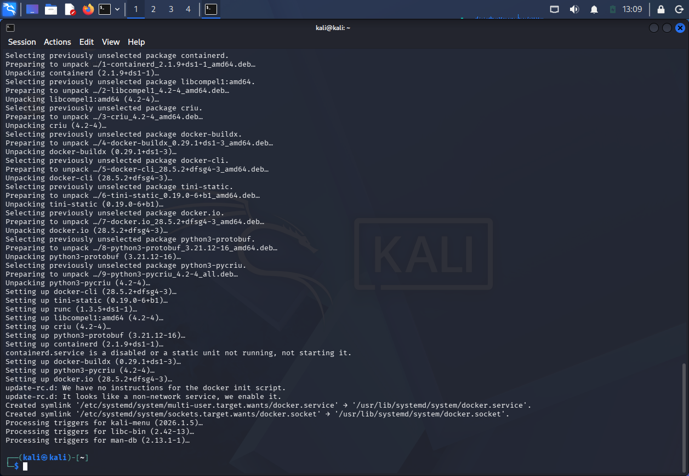
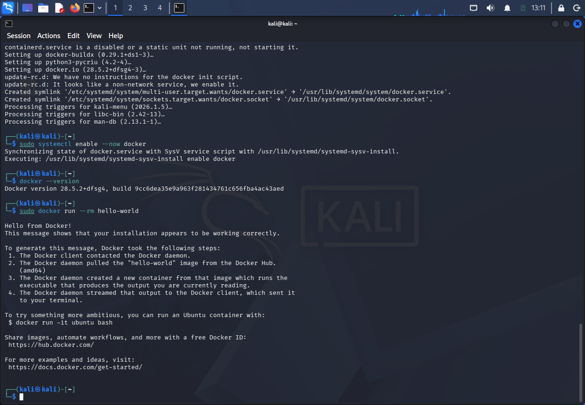
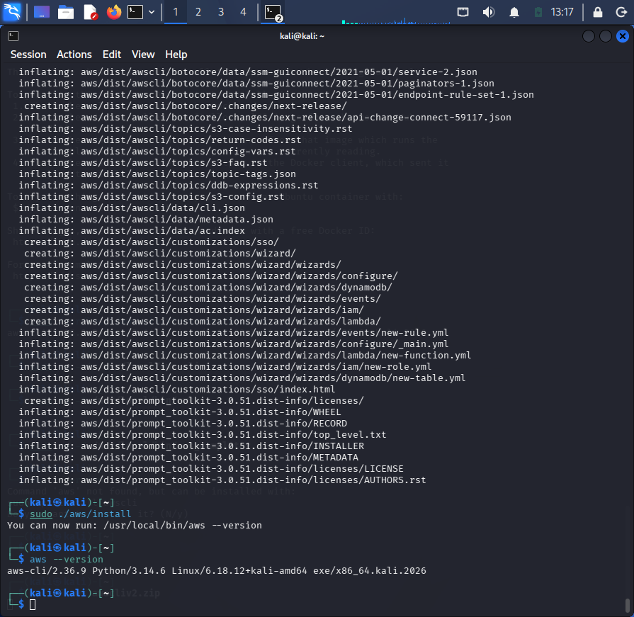
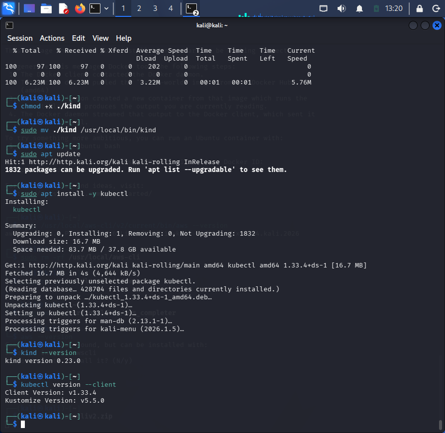
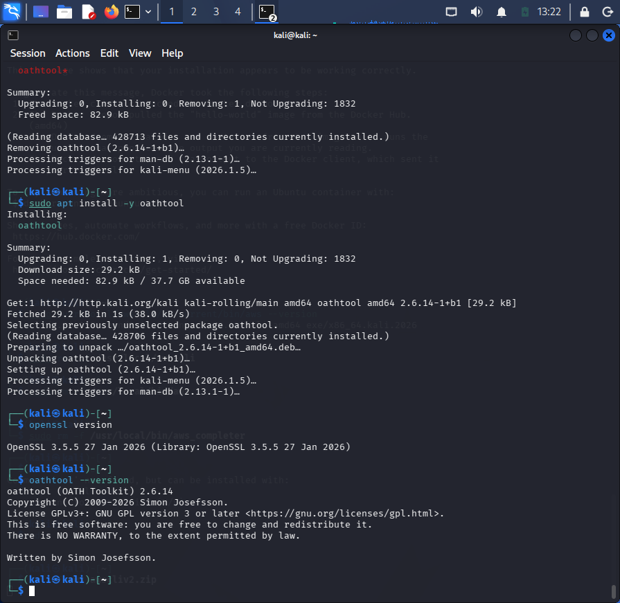
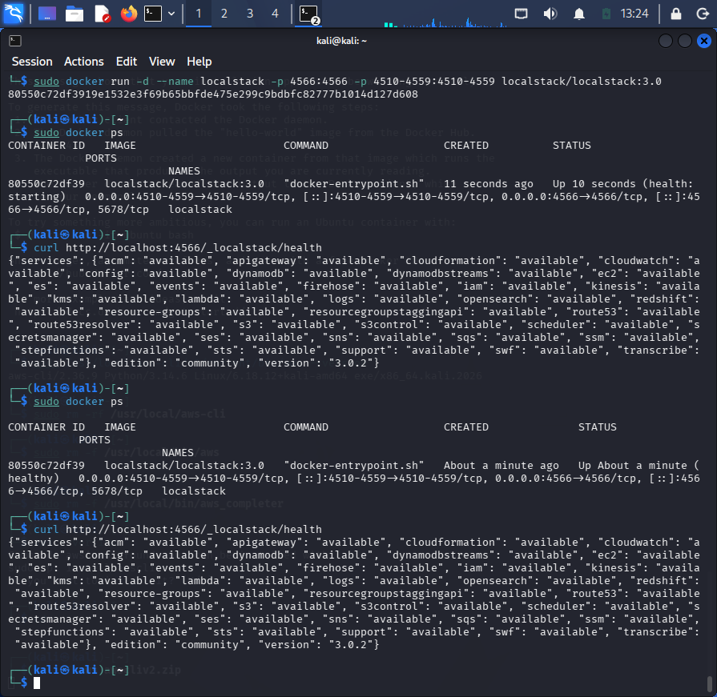
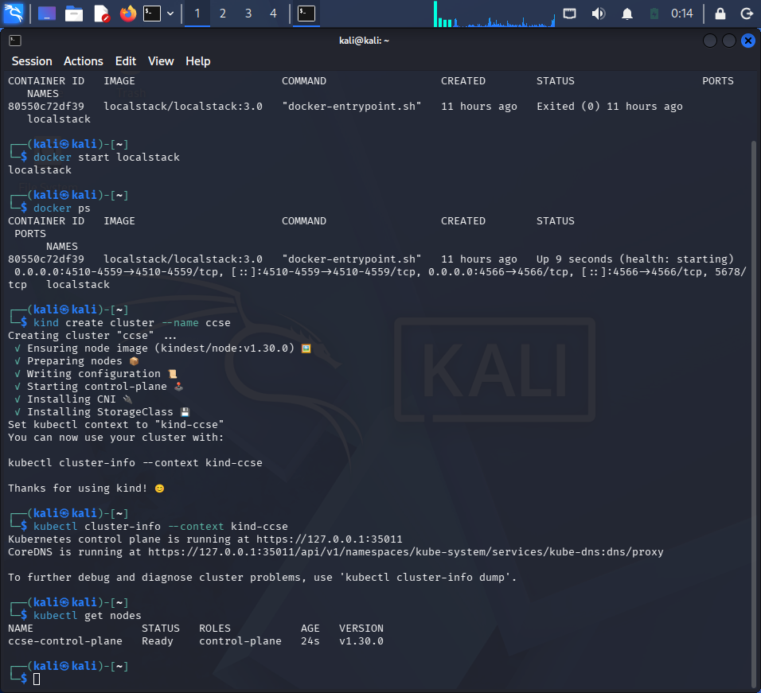
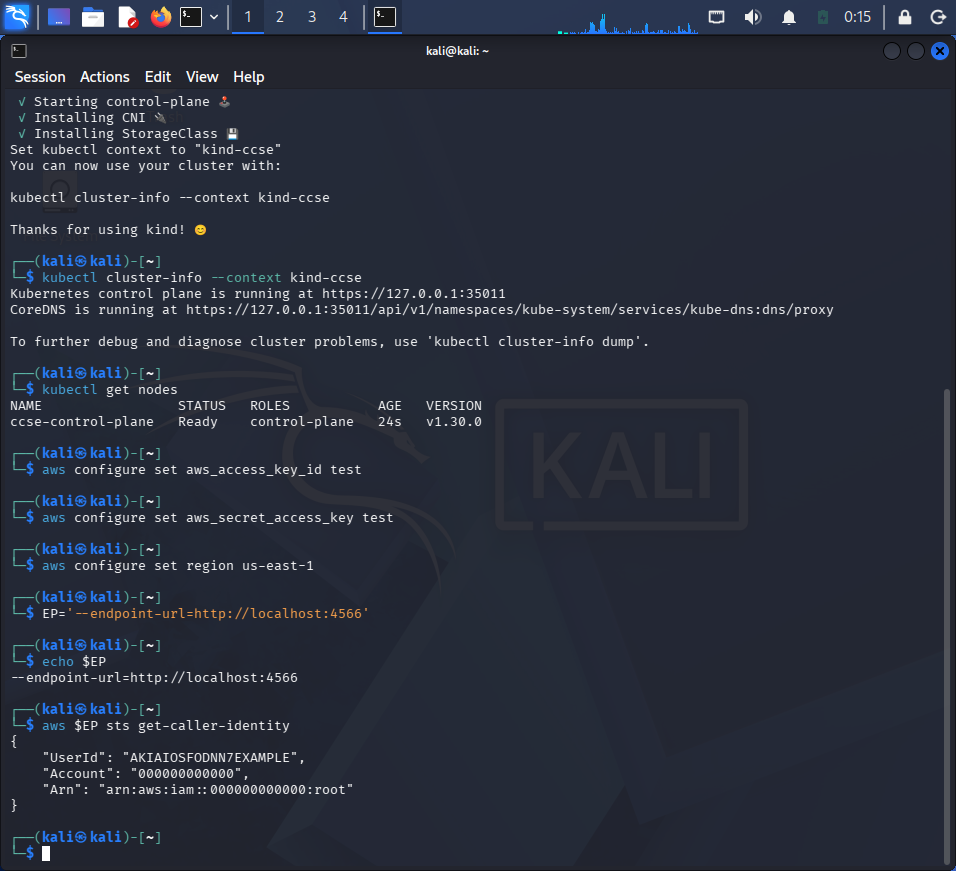

# Lab 0: Environment Setup

## Objectives
To prepare the required environment for the upcoming Cloud Computing Security Essentials lab activities. The setup includes Docker, AWS CLI v2, kind, kubectl, OpenSSL, oathtool, LocalStack, and a local Kubernetes cluster.

## Learning Outcomes
- Install and verify the required cloud security tools.
- Use Docker to run containers.
- Configure AWS CLI for a local AWS environment.
- Run LocalStack using Docker.
- Create and verify a local Kubernetes cluster using kind.

## Step-by-Step Implementation

### Step 1: Install Docker

- Install Docker version and check version with 'docker --version'
- Run the 'hello-world' container

### Step 2: AWS CLI Setup

- Install AWS CLI v2 for use with the local AWS environment
- Confirm the installation with 'aws --version'

### Step 3: kind and kubectl Setup

- Install kind for creating a local Kubernetes cluster
- Install kubectl for managing Kubernetes cluster
- Check installation with command 'kind --version' and 'kubectl version --client'

### Step 4: Helper Tools Setup

- Check OpenSSL version with 'openssl version'
- Verify oathtool installation with 'oathtool --version'

### Step 5: LocalStack Setup

- Run LocalStack locally using Docker
- Check the LocalStack container and health status

### Step 6: Kubernetes Cluster Setup

- Create local Kubernetes cluster named 'ccse' using kind
- Check the cluster information and node status using kubectl

### Step 7: AWS CLI Configuration for LocalStack

- Configure AWS CLI with dummy credentials for LocalStack
- Set the LocalStack endpoint to port '4566'
- Test the connection using 'aws $EP sts get-caller-identity`

## Challenges Encountered

- Docker permission issue occurred when creating the kind cluster.
- The issue was resolved by adding the user to the Docker group and rebooting the system.
- LocalStack needed to be restarted after rebooting Kali Linux.

## Lessons Learned

- Able to set up the required tools for a local cloud security environment.
- Learned how to run LocalStack using Docker.
- Can create and verify a local Kubernetes cluster using kind and kubectl.
- Able to connect AWS CLI to LocalStack.
