# Lab 1: Account Security and IAM

## Objectives

- Understand AWS Identity and Access Management (IAM).
- Create IAM users, groups, and policies using LocalStack.
- Apply the Principle of Least Privilege.
- Configure Kubernetes Role-Based Access Control (RBAC).

---

## Learning Outcomes

By the end of this lab, I am able to:

- Configure IAM users, groups, and policies.
- Create and manage access keys.
- Configure Kubernetes RBAC.
- Verify user permissions using kubectl.

---

# Environment Setup

## Step 1: Verify Docker

**Command**

```bash
docker --version
```

**Output**

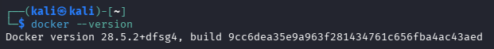

---

## Step 2: Start LocalStack

**Command**

```bash
docker start localstack
```

**Output**

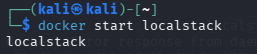

---

## Step 3: Verify LocalStack Health

**Command**

```bash
curl http://localhost:4566/_localstack/health
```

**Output**

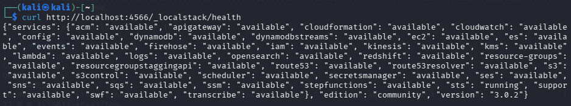

---

## Step 4: Configure AWS CLI

**Command**

```bash
aws configure set aws_access_key_id test
aws configure set aws_secret_access_key test
aws configure set region us-east-1
```

---

## Step 5: Verify Current Identity

**Command**

```bash
aws --endpoint-url=http://localhost:4566 sts get-caller-identity
```

**Output**

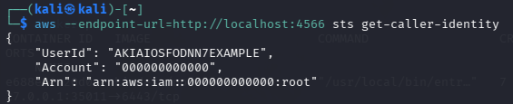

---

# Task 1: Cloud Identity Concepts

| Concept | AWS Term | Purpose |
|----------|----------|---------|
| All-powerful owner | Root User | Has full access to all AWS services and resources. |
| Human/Application identity | IAM User | Represents a person or application with specific permissions. |
| Permission bundle | IAM Policy | Defines what actions are allowed or denied. |
| Collection of users | IAM Group | Organizes users who share the same permissions. |
| Temporary identity | IAM Role | Provides temporary permissions without permanent credentials. |

---

# Task 2: Create Least-Privilege Admin

**Command**

```bash
EP="--endpoint-url=http://localhost:4566"

aws $EP iam create-group --group-name Admins

aws $EP iam attach-group-policy \
--group-name Admins \
--policy-arn arn:aws:iam::aws:policy/AdministratorAccess

aws $EP iam create-user --user-name CloudAdmin_Nabihah

aws $EP iam add-user-to-group \
--group-name Admins \
--user-name CloudAdmin_Nabihah

aws $EP iam get-group --group-name Admins
```

**Output**

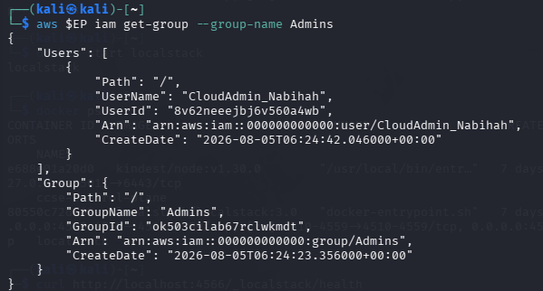

---

# Task 3: Create Read-Only Analyst

**Command**

```bash
aws $EP iam create-user --user-name Analyst_Nabihah

aws $EP iam attach-user-policy \
--user-name Analyst_Nabihah \
--policy-arn arn:aws:iam::aws:policy/AmazonS3ReadOnlyAccess

aws $EP iam list-attached-user-policies \
--user-name Analyst_Nabihah
```

**Output**

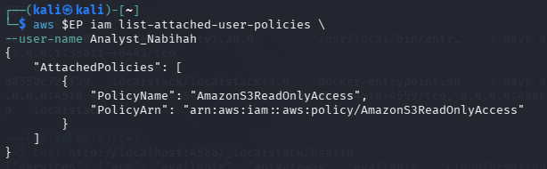

---

# Task 4: Credential Hygiene

**Command**

```bash
aws $EP iam create-access-key \
--user-name Analyst_Nabihah

aws $EP iam list-access-keys \
--user-name Analyst_Nabihah

aws $EP iam update-access-key \
--user-name Analyst_Nabihah \
--access-key-id YOUR_ACCESS_KEY_ID \
--status Inactive
```

**Output**

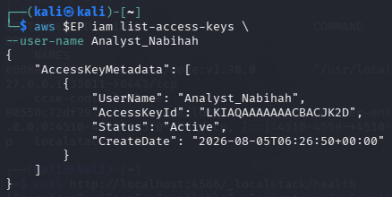

---

# Task 5: Create Kubernetes Namespace

**Command**

```bash
kubectl create namespace dev

kubectl create namespace prod

kubectl get namespaces
```

**Output**

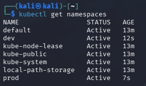

---

# Task 6: Configure RBAC

**Command**

```bash
kubectl create serviceaccount dev-user -n dev

kubectl create role pod-reader \
--verb=get,list,watch \
--resource=pods \
-n dev

kubectl create rolebinding dev-user-binding \
--role=pod-reader \
--serviceaccount=dev:dev-user \
-n dev
```

---

# Task 7: Verify RBAC

**Command**

```bash
SA="system:serviceaccount:dev:dev-user"

kubectl auth can-i list pods -n dev --as=$SA

kubectl auth can-i delete pods -n dev --as=$SA

kubectl auth can-i list pods -n prod --as=$SA

kubectl get rolebinding dev-user-binding -n dev -o yaml
```

### List Pods (dev)

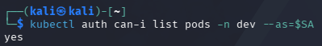

### Delete Pods (dev)

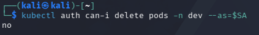

### List Pods (prod)

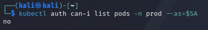

### RoleBinding

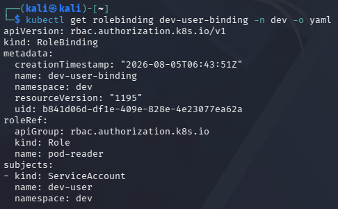

---

# Short Answers

### 1. Why is attaching policies to groups better than attaching them directly to users?

Attaching policies to groups makes permission management easier because permissions can be managed for multiple users at once.

### 2. What is the difference between an IAM User and an IAM Role?

An IAM User has permanent credentials, while an IAM Role provides temporary permissions.

### 3. Explain the Principle of Least Privilege using the Analyst account.

The Analyst account only has read-only access to Amazon S3. It cannot modify or delete resources.

### 4. What is the difference between a Role and a RoleBinding in Kubernetes?

A Role defines permissions, while a RoleBinding assigns those permissions to a user or service account.

### 5. Why did the service account fail to list pods in the prod namespace?

The RoleBinding only grants permissions in the **dev** namespace, so access to the **prod** namespace is denied.

---

# Conclusion

This lab demonstrated how IAM users, groups, policies, and access keys can be managed using LocalStack. Kubernetes RBAC was also configured to control access based on namespaces and apply the Principle of Least Privilege.# Lab 1: Account Security and IAM
