# Lab 2: Secure Isolation & Multi-Tenancy

## 1. Lab Overview

This lab demonstrates secure isolation and multi-tenancy in a cloud-native environment using Docker and Kubernetes.

The lab focuses on three isolation dimensions:

- Compute isolation
- Network isolation
- Storage isolation

The main activities include Kubernetes namespaces, resource quotas, NetworkPolicy, RBAC-based secret isolation, and secure deletion.

---

## 2. Learning Outcomes

At the end of this lab, the following concepts were demonstrated:

1. Compute isolation by separating tenants into Kubernetes namespaces.
2. The default-open behaviour of shared infrastructure and its security risks.
3. Network isolation using a default-deny NetworkPolicy.
4. Storage and secret isolation between tenants.
5. Data remanence and secure deletion.

---

## 3. Environment

### Tools Used

- Kali Linux
- Docker
- kind
- kubectl
- Kubernetes
- Calico

### Kubernetes Cluster

Cluster name:

```text
ccse-lab2
```

Pod subnet:

```text
192.168.0.0/16
```

The default kind CNI was disabled so that Calico could be used to enforce NetworkPolicy.

---

# 4. Cluster Setup

## 4.1 Create Kubernetes Cluster

The cluster was created using kind with the default CNI disabled:

```bash
cat <<EOF | kind create cluster --name ccse-lab2 --config=-
kind: Cluster
apiVersion: kind.x-k8s.io/v1alpha4
networking:
  disableDefaultCNI: true
  podSubnet: 192.168.0.0/16
EOF
```

The cluster was verified using:

```bash
kubectl get nodes
```

The control-plane node was successfully shown as `Ready`.

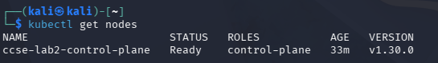

---

## 4.2 Install Calico

Calico was installed as the cluster networking component:

```bash
kubectl apply -f https://raw.githubusercontent.com/projectcalico/calico/v3.27.0/manifests/calico.yaml
```

The Calico node was then verified:

```bash
kubectl -n kube-system rollout status daemonset/calico-node --timeout=180s
```

The result confirmed:

```text
daemon set "calico-node" successfully rolled out
```

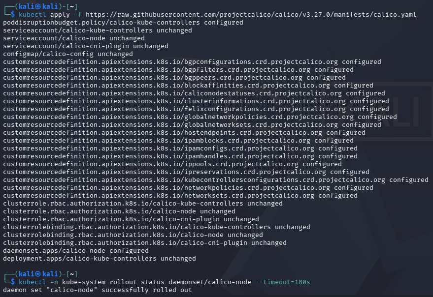

---

# 5. Task 1 — Two Tenants on One Cluster

Two customers were modelled as two Kubernetes namespaces:

```bash
kubectl create namespace tenant-a
kubectl create namespace tenant-b
```

A simple nginx web server was deployed for each tenant:

```bash
kubectl -n tenant-a create deployment web --image=nginx
kubectl -n tenant-b create deployment web --image=nginx
```

The deployments were exposed as services:

```bash
kubectl -n tenant-a expose deployment web --port=80
kubectl -n tenant-b expose deployment web --port=80
```

The pods and services were verified using:

```bash
kubectl get pods,svc -n tenant-a
kubectl get pods,svc -n tenant-b
```

This demonstrated logical tenant separation using Kubernetes namespaces while both tenants shared the same Kubernetes cluster.

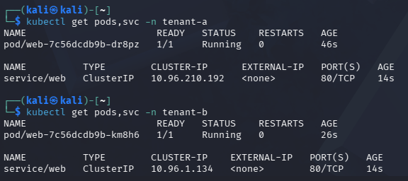

---

# 6. Task 2 — Observe the Default-Open Risk

The ClusterIP of the `tenant-b` web service was obtained using:

```bash
kubectl get svc web -n tenant-b -o jsonpath='{.spec.clusterIP}'; echo
```

The probe was then launched from `tenant-a` to access the `tenant-b` service:

```bash
kubectl -n tenant-a run probe --rm -it --image=curlimages/curl --restart=Never \
-- curl -s -m 5 http://<B_IP> -o /dev/null -w 'HTTP %{http_code}\n'
```

The initial result was:

```text
HTTP 200
```

This demonstrated that traffic between the two tenant namespaces was allowed by default before a NetworkPolicy was applied.

The result shows the multi-tenancy risk of shared infrastructure when network isolation is not explicitly configured.

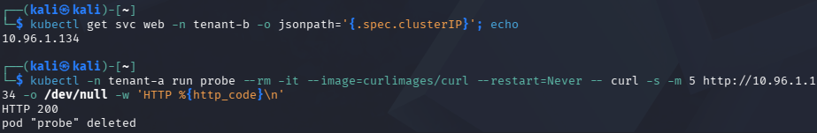

---

# 7. Task 3 — Contain the Noisy Neighbour with ResourceQuota

A ResourceQuota was applied to `tenant-a` so that one tenant could not exhaust shared cluster resources.

The quota was configured as:

```yaml
apiVersion: v1
kind: ResourceQuota
metadata:
  name: tenant-a-quota
  namespace: tenant-a
spec:
  hard:
    requests.cpu: "1"
    requests.memory: 512Mi
    pods: "5"
```

The quota was verified using:

```bash
kubectl describe resourcequota tenant-a-quota -n tenant-a
```

The quota limits:

- CPU requests to 1
- Memory requests to 512 MiB
- Pods to 5

This demonstrates resource isolation and protection against a noisy-neighbour scenario.

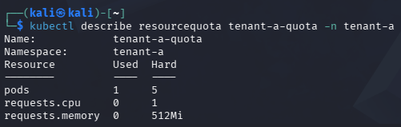

---

# 8. Task 4 — Default-Deny Network Isolation

A default-deny ingress NetworkPolicy was applied to `tenant-b`.

The policy used was:

```yaml
apiVersion: networking.k8s.io/v1
kind: NetworkPolicy
metadata:
  name: default-deny-ingress
  namespace: tenant-b
spec:
  podSelector: {}
  policyTypes: [Ingress]
```

The policy denies all incoming traffic to the selected pods in `tenant-b` unless traffic is explicitly permitted.

The same probe from Task 2 was then executed again:

```bash
kubectl -n tenant-a run probe --rm -it --image=curlimages/curl --restart=Never \
-- curl -s -m 5 http://<B_IP> -o /dev/null -w 'HTTP %{http_code}\n'
```

### Before NetworkPolicy

```text
HTTP 200
```

### After NetworkPolicy

The probe failed to receive an HTTP response:

```text
HTTP 000
```

This demonstrates that cross-tenant traffic was blocked after the default-deny NetworkPolicy was applied.

The before/after results provide evidence of enforced network isolation.

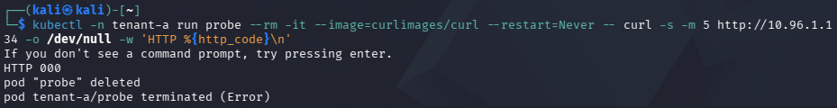

---

# 9. Task 5 — Storage & Secret Isolation

A secret was created for each tenant:

```bash
kubectl -n tenant-a create secret generic data --from-literal=value=SECRET_A
kubectl -n tenant-b create secret generic data --from-literal=value=SECRET_B
```

A service account scoped to `tenant-a` was created:

```bash
kubectl -n tenant-a create serviceaccount app-a
```

A Role allowing the service account to read secrets was created:

```bash
kubectl -n tenant-a create role reader --verb=get --resource=secrets
```

The Role was bound to the service account:

```bash
kubectl -n tenant-a create rolebinding rb \
--role=reader \
--serviceaccount=tenant-a:app-a
```

The service account identity was set:

```bash
SA=system:serviceaccount:tenant-a:app-a
```

The permissions were tested:

```bash
kubectl auth can-i get secrets -n tenant-a --as=$SA
```

Result:

```text
yes
```

The same service account was then tested against `tenant-b`:

```bash
kubectl auth can-i get secrets -n tenant-b --as=$SA
```

Result:

```text
no
```

This demonstrates that the service account from `tenant-a` can access secrets within its own namespace but cannot access secrets belonging to `tenant-b`.

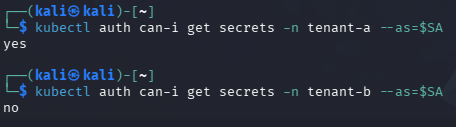

---

# 10. Task 6 — Data Remanence & Secure Deletion

## 10.1 Data Remanence Demonstration

A sensitive file was created and then deleted normally:

```bash
docker run --rm -v ccse-vol:/data alpine sh -c \
'echo SENSITIVE-PATIENT-RECORD > /data/phi.txt; sync; rm /data/phi.txt; \
grep -a SENSITIVE /data/* 2>/dev/null; echo scan-done'
```

The command completed with:

```text
scan-done
```

This demonstrates the concept of data remanence and why simply deleting a file does not necessarily guarantee secure removal of underlying data.

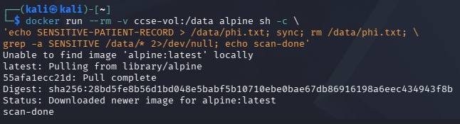

---

## 10.2 Secure Wipe

A second file was created and overwritten before deletion:

```bash
docker run --rm -v ccse-vol:/data alpine sh -c \
'echo SENSITIVE > /data/phi2.txt; sync; \
dd if=/dev/zero of=/data/phi2.txt bs=1k count=1 conv=notrunc; rm /data/phi2.txt; \
echo wiped'
```

The operation completed with:

```text
wiped
```

This demonstrates overwriting data before deletion as a secure deletion technique.

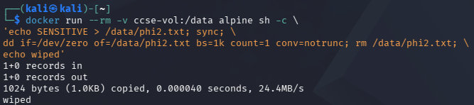

In cloud storage, users rarely control the physical storage blocks. Therefore, cryptographic erasure, such as destroying the encryption key, is the practical solution for data remanence.

---

# 11. Verification

## 11.1 Verify NetworkPolicy

The NetworkPolicy configuration was verified using:

```bash
kubectl get networkpolicy -A
```

The `tenant-b` namespace contained:

```text
default-deny-ingress
```

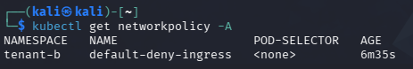

---

## 11.2 Verify ResourceQuota

The ResourceQuota was verified using:

```bash
kubectl describe resourcequota tenant-a-quota -n tenant-a
```

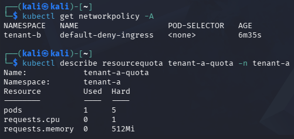

---

# 12. Short-Answer Questions

## Q1. Why can containers in different namespaces reach each other by default, and why is that dangerous in multi-tenant cloud?

Containers in different Kubernetes namespaces can reach each other by default because namespaces provide logical separation but do not automatically provide network isolation.

Without a NetworkPolicy, traffic between pods in different namespaces can be allowed.

This is dangerous in a multi-tenant cloud because one tenant may be able to communicate with another tenant's services or applications. This can create a risk of unauthorized access and cross-tenant compromise.

The Task 2 result demonstrated this behaviour because `tenant-a` successfully reached `tenant-b` and returned `HTTP 200`.

---

## Q2. Explain the default-deny principle and how your NetworkPolicy implements it.

The default-deny principle means that traffic is blocked unless it is explicitly allowed.

The NetworkPolicy applied to `tenant-b` used:

```yaml
podSelector: {}
```

to select the pods and:

```yaml
policyTypes: [Ingress]
```

to control incoming traffic.

Therefore, incoming traffic to the selected pods is denied by default.

The same probe that returned `HTTP 200` before the policy failed after the policy was applied. This demonstrated the deny-by-default network isolation principle.

---

## Q3. How do virtual machines and containers differ in isolation strength? When would you add a VM boundary?

Containers provide logical isolation while sharing the host operating system kernel.

Virtual machines generally provide stronger isolation because each VM has its own operating system and kernel.

A VM boundary can be added when stronger isolation is required, especially for highly sensitive workloads or when stronger separation between tenants is needed.

---

## Q4. What is data remanence, and why is cryptographic erasure the preferred cloud solution?

Data remanence refers to data that may remain on storage even after a file has been deleted normally.

Simply deleting a file does not necessarily guarantee that the underlying data has been securely erased.

In cloud storage, users normally do not control the physical storage blocks. Therefore, cryptographic erasure is a practical solution because destroying the encryption key makes encrypted data inaccessible.

---

## Q5. Which of the three isolation dimensions (compute, network, storage) did each task exercise?

| Task | Isolation Dimension | Demonstration |
|---|---|---|
| Task 1 | Compute | Tenants were separated using Kubernetes namespaces. |
| Task 2 | Network | Default-open cross-tenant communication was demonstrated. |
| Task 3 | Compute | ResourceQuota limited shared resource consumption. |
| Task 4 | Network | Default-deny NetworkPolicy blocked cross-tenant traffic. |
| Task 5 | Storage | RBAC restricted secret access between tenants. |
| Task 6 | Storage | Data remanence and secure deletion were demonstrated. |

---

# 13. Security Best-Practices Checklist

- [x] Tenants are separated into distinct namespaces.
- [x] A default-deny NetworkPolicy blocks cross-tenant traffic and was verified before and after.
- [x] Resource quotas prevent a noisy-neighbour from exhausting shared capacity.
- [x] Per-tenant secrets are unreadable by other tenants through RBAC.
- [x] Secure deletion and cryptographic erasure are understood for data remanence.

---

# 14. Conclusion

This lab demonstrated secure isolation and multi-tenancy using Kubernetes.

The lab showed how namespaces provide tenant separation, ResourceQuota limits shared resource consumption, NetworkPolicy provides network isolation, and RBAC restricts access to tenant-specific secrets.

The data remanence exercise also demonstrated the importance of secure deletion and cryptographic erasure in cloud environments.

Effective multi-tenant isolation requires appropriate controls across compute, network, and storage.

---

# 15. Cleanup & Teardown

After all screenshots, CLI outputs, answers, and documentation have been completed, the lab environment can be removed using:

```bash
kind delete cluster --name ccse-lab2
docker volume rm ccse-vol
```
