# Lab 3: Encryption & Key Management

## 1. Lab Overview

This lab demonstrates encryption and key management techniques in a cloud-native environment.

The lab covers:

- Symmetric encryption using AES
- Asymmetric encryption and digital signatures using RSA
- Encryption in transit using TLS/HTTPS
- AWS KMS operations using LocalStack
- Data key generation and envelope encryption
- Tenant-specific key management
- Cryptographic erasure
- SHA-256 integrity verification and hash chaining

---

## 2. Learning Outcomes

At the end of this lab, the following concepts were demonstrated:

1. Symmetric encryption and decryption using AES.
2. RSA key-pair generation and digital signature verification.
3. TLS encryption for data in transit.
4. KMS key creation and encryption operations.
5. Data key generation and envelope encryption.
6. Key separation between tenants.
7. Cryptographic erasure and its effect on encrypted data.
8. SHA-256 hashing and integrity verification.

---

## 3. Environment

### Tools Used

- Kali Linux
- OpenSSL
- Docker
- Nginx
- AWS CLI
- LocalStack

### LocalStack Endpoint

    http://localhost:4566

### Working Directory

    ~/IKB42603-CLOUD-COMPUTING-SECURITY-ESSENTIALS/Lab3_Encryption_and_Key_Management

---

# 4. Task 1 — AES Symmetric Encryption

AES symmetric encryption was used to encrypt a file and then decrypt it again using the same encryption key.

The encrypted file was generated using OpenSSL:

    openssl enc -aes-256-cbc -salt -in record.txt -out record.enc -pass pass:'<PASSWORD>'

The encrypted file was then decrypted:

    openssl enc -d -aes-256-cbc -in record.enc -out record.dec -pass pass:'<PASSWORD>'

The decrypted content was compared with the original record:

    diff record.txt record.dec

The matching result demonstrates that the encrypted data could be successfully recovered using the correct key.

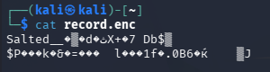

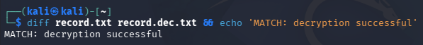

---

# 5. Task 2 — RSA Key Pair and Digital Signature

## 5.1 Generate RSA Key Pair

An RSA private key was generated using OpenSSL:

    openssl genrsa -out private.pem 2048

The public key was extracted from the private key:

    openssl rsa -in private.pem -pubout -out public.pem

The generated key pair was verified:

    ls -l private.pem public.pem

The private key is kept secret and is used to generate the digital signature. The public key can be shared and is used to verify the signature.

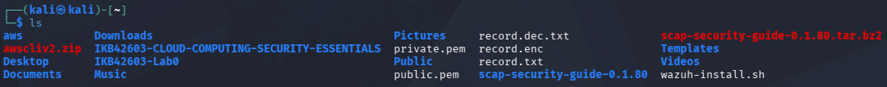

---

## 5.2 Generate and Verify Digital Signature

The record was signed using the RSA private key and SHA-256:

    openssl dgst -sha256 -sign private.pem -out record.sig record.txt

The signature was verified using the RSA public key:

    openssl dgst -sha256 -verify public.pem -signature record.sig record.txt

The verification result was:

    Verified OK

The successful verification demonstrates that the record has not been modified and that the signature was generated using the corresponding private key.

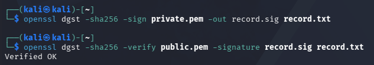

---

# 6. Task 3 — Encryption in Transit Using TLS

TLS was used to protect data transmitted between a client and an Nginx HTTPS server.

A self-signed certificate was generated using OpenSSL:

    openssl req -x509 -newkey rsa:2048 -keyout key.pem -out cert.pem -days 7 -nodes -subj "/CN=localhost"

Nginx was configured to use the generated certificate and private key.

The HTTPS service was accessed using:

    curl -k https://localhost:8443/record.txt

The successful HTTPS response demonstrates that the record could be transferred through an encrypted TLS connection.

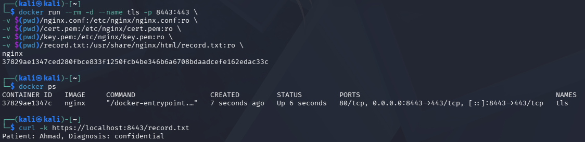

---

# 7. Task 4 — AWS KMS Using LocalStack

## 7.1 Start LocalStack

The LocalStack container was started:

    docker start localstack

The running container was verified:

    docker ps

The LocalStack endpoint was configured:

    export EP=http://localhost:4566

KMS keys were checked using:

    aws $EP kms list-keys

LocalStack provides a local AWS-compatible environment for testing KMS operations.

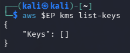

---

## 7.2 Create KMS Key

A KMS key was created for the tenant:

    aws $EP kms create-key --description 'CCSE tenant-A master key'

The Key ID was obtained from the command output and stored in an environment variable:

    KEY_A=<KEY_ID>

The key ID was verified using:

    aws $EP kms list-keys

The KMS key is used as a master key for cryptographic operations.

---

## 7.3 Encrypt Data Using KMS

The plaintext value was encrypted using the KMS key:

    aws $EP kms encrypt \
    --key-id $KEY_A \
    --plaintext "$(echo -n 'hello' | base64)" \
    --query CiphertextBlob \
    --output text

The command returned a ciphertext blob.

This demonstrates the use of a KMS-managed key to encrypt data.

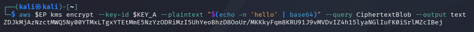

---

# 8. Task 5 — Data Key and Envelope Encryption

## 8.1 Generate a Data Key

A 256-bit AES data key was generated using KMS:

    aws $EP kms generate-data-key \
    --key-id $KEY_A \
    --key-spec AES_256 \
    --query '[Plaintext,CiphertextBlob]' \
    --output text

The generated plaintext data key was saved for the encryption operation while the encrypted version was retained as the protected data key.

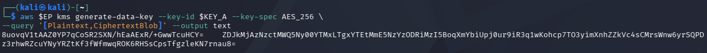

---

## 8.2 Store the Data Key Files

The generated data key material was stored in files for the envelope encryption demonstration.

The relevant files were checked using:

    ls -l datakey*

The plaintext and encrypted forms demonstrate the difference between the usable data key and the KMS-protected data key.

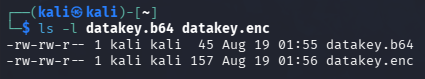

---

## 8.3 Envelope Encryption

Envelope encryption was demonstrated by using the generated data key to protect the actual data while KMS protects the data key.

The data key was decoded:

    base64 -d datakey.b64 > datakey.bin

The record was encrypted using the data key:

    openssl enc -aes-256-cbc \
    -in record.txt \
    -out record.enc \
    -pass file:./datakey.bin

The encrypted data and protected key can then be stored separately.

This approach avoids using the KMS master key directly for every piece of application data.

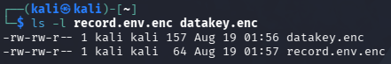

---

## 8.4 Remove Plaintext Data Key

After the encryption operation, the plaintext data key was removed:

    rm -f datakey.bin

The remaining encrypted data key can be retained for future decryption through KMS.

Removing the plaintext key reduces the risk of exposing sensitive key material.

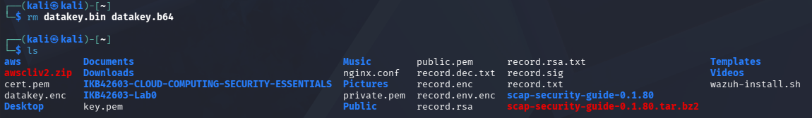

---

# 9. Task 6 — Tenant Key Separation and Cryptographic Erasure

## 9.1 Create a Tenant-B KMS Key

A separate KMS key was created for tenant-B:

    aws $EP kms create-key --description 'CCSE tenant-B master key'

The resulting Key ID was recorded and used as the tenant-B key.

Using separate keys provides logical cryptographic separation between tenants.

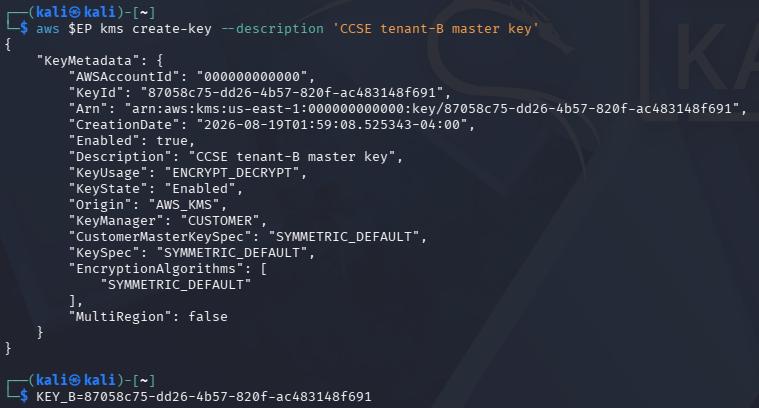

---

## 9.2 Cryptographic Erasure

The effect of KMS key lifecycle management on encrypted data was demonstrated.

An encrypted data key was used with a KMS key that was no longer available for normal decryption operations.

The decryption operation resulted in a KMS error because the required key was unavailable.

This demonstrates the principle of cryptographic erasure: destroying or making the encryption key unavailable can make the encrypted data inaccessible without physically overwriting every storage block.

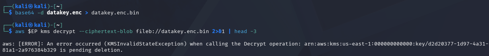

---

# 10. Task 7 — SHA-256 Integrity and Hash Chain

## 10.1 Calculate Original SHA-256

The SHA-256 hash of the original record was calculated:

    sha256sum record.txt

The resulting hash provides a cryptographic fingerprint of the original data.

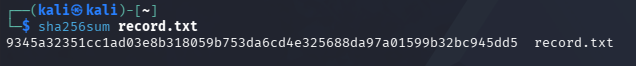

---

## 10.2 Detect File Modification

The record was modified and its SHA-256 hash was calculated again:

    sha256sum record.txt

The resulting hash differed from the original hash.

This demonstrates that even a small change to the file produces a different cryptographic hash, allowing data modification to be detected.

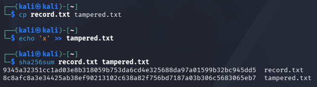

---

## 10.3 Hash Chain

A hash chain was demonstrated by using the output hash from one record as part of the input for the next record.

The hash chain provides a method of detecting changes to previously recorded data because modifying an earlier record changes the subsequent hash values.

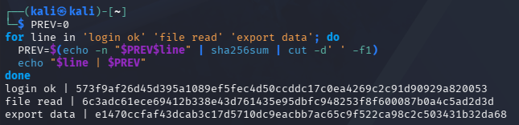

---

# 11. Final Verification

The RSA signature was verified again using:

    openssl dgst -sha256 -verify public.pem -signature record.sig record.txt

The verification result was:

    Verified OK

This confirms that the signed record remained valid and that the data integrity and authenticity check was successful.

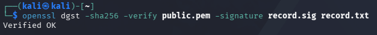

---

# 12. Security Best-Practices Checklist

- [x] AES was used for symmetric encryption.
- [x] RSA was used for asymmetric cryptography and digital signatures.
- [x] SHA-256 was used for integrity verification.
- [x] TLS was used to protect data in transit.
- [x] KMS was used for encryption key management.
- [x] Data keys were used for envelope encryption.
- [x] Separate KMS keys were demonstrated for different tenants.
- [x] Plaintext key material was removed after use.
- [x] Cryptographic erasure was demonstrated.
- [x] Hash chaining was used to detect changes to recorded data.

---

# 13. Conclusion

This lab demonstrated the use of encryption and key management techniques in a cloud environment.

AES provided symmetric encryption for data, while RSA provided asymmetric cryptography and digital signature verification. TLS protected data while it was transmitted over a network.

LocalStack was used to demonstrate AWS KMS operations, including key creation, encryption, data key generation, tenant-specific key separation, and cryptographic erasure.

The final SHA-256 and hash-chain exercises demonstrated how cryptographic hashes can be used to detect changes to data.

Overall, the lab demonstrated that effective cloud security requires protection of data both in transit and at rest, together with proper encryption key management and integrity controls.

---

# 14. GitHub Documentation

The Lab 3 directory was accessed using:

    cd ~/IKB42603-CLOUD-COMPUTING-SECURITY-ESSENTIALS/Lab3_Encryption_and_Key_Management

The README and screenshots were added to Git:

    git add README.md screenshots/

The changes were committed:

    git commit -m "Complete Lab 3 documentation"

The documentation was pushed to GitHub:

    git push origin main

The final Git status was checked using:

    git status

---

# 15. Cleanup

After completing the lab and saving all required evidence, the LocalStack and Nginx containers can be stopped:

    docker stop tls
    docker stop localstack
