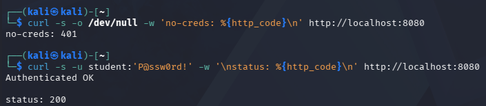
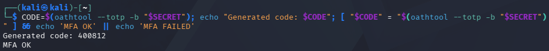
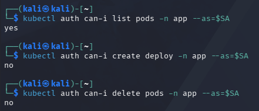
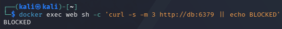
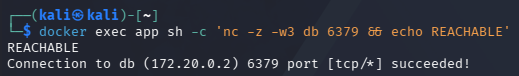
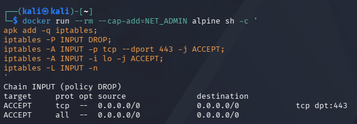
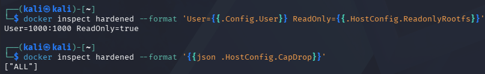
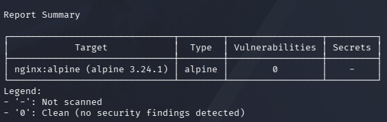

# IKB42603 CLOUD COMPUTING SECURITY ESSENTIALS
# LAB 4 — ACCESS CONTROL & NETWORK SECURITY

## Student Information

Name: NURNABIHAH IBTISAM BINTI ZAMREE

Student ID: 52215124482

Lab: Lab 4

Topic: Access Control & Network Security

---

# SESSION A — AUTHENTICATION & AUTHORIZATION

# TASK 1 — AUTHENTICATION: PASSWORD-PROTECTED SERVICE

## Step 1: Create the password file

Command:

docker run --rm httpd:alpine htpasswd -nbB student 'P@ssw0rd!' > htpasswd.txt

Check the password file:

cat htpasswd.txt

The password file was successfully created for the user `student`.

---

## Step 2: Create the Nginx configuration file

Command:

cat > default.conf <<'EOF'
server {
    listen 80;

    location / {
        auth_basic "Restricted";
        auth_basic_user_file /etc/nginx/.htpasswd;

        root /usr/share/nginx/html;
        index index.html;
    }
}
EOF

The configuration enables HTTP Basic Authentication for the web service.

---

## Step 3: Start the authentication service

Command:

docker run --rm -d --name authsvc -p 8080:80 \
-v $(pwd)/default.conf:/etc/nginx/conf.d/default.conf \
-v $(pwd)/htpasswd.txt:/etc/nginx/.htpasswd nginx

Check the running container:

docker ps

The `authsvc` container was successfully started and exposed on port 8080.

---

## Step 4: Test without credentials

Command:

curl -s -o /dev/null -w 'no-creds: %{http_code}\n' http://localhost:8080

Expected result:

no-creds: 401

The request was rejected because no authentication credentials were provided.

---

## Step 5: Test with valid credentials

Command:

curl -s -u student:'P@ssw0rd!' -w '\nstatus: %{http_code}\n' http://localhost:8080

Expected result:

Authenticated OK
status: 200

The request was successfully authenticated using the valid username and password.

---

# TASK 2 — MULTI-FACTOR AUTHENTICATION (MFA / TOTP)

## Step 1: Generate a shared secret

Command:

SECRET=$(head -c20 /dev/urandom | base32)

Display the secret:

echo "Enrol this secret in an authenticator app: $SECRET"

A Base32 secret was generated for the TOTP authentication process.

---

## Step 2: Generate the current 6-digit TOTP code

Command:

oathtool --totp -b "$SECRET"

The command generated a current six-digit time-based one-time password.

---

## Step 3: Validate the MFA code

Command:

CODE=$(oathtool --totp -b "$SECRET"); echo "Generated code: $CODE"; [ "$CODE" = "$(oathtool --totp -b "$SECRET")" ] && echo 'MFA OK' || echo 'MFA FAILED'

Expected result:

Generated code: [6-DIGIT CODE]
MFA OK

The generated TOTP code was successfully validated.

---

# TASK 3 — AUTHORIZATION: RBAC ROLES

## Step 1: Create the Kubernetes cluster

Command:

kind create cluster --name ccse-lab4

A Kubernetes cluster named `ccse-lab4` was created.

---

## Step 2: Create the namespace

Command:

kubectl create namespace app

The `app` namespace was created successfully.

---

## Step 3: Create the developer service account

Command:

kubectl create serviceaccount dev -n app

The `dev` service account was created in the `app` namespace.

---

## Step 4: Create the developer role

Command:

kubectl create role dev-role -n app --verb=get,list --resource=pods

The developer role was configured with permission to get and list pods.

---

## Step 5: Create the role binding

Command:

kubectl create rolebinding dev-rb -n app --role=dev-role --serviceaccount=app:dev

The `dev` service account was successfully bound to the `dev-role`.

---

## Step 6: Define the service account

Command:

SA=system:serviceaccount:app:dev

---

## Step 7: Test RBAC permissions

Test whether the developer can list pods:

kubectl auth can-i list pods -n app --as=$SA

Result:

yes

Test whether the developer can create deployments:

kubectl auth can-i create deploy -n app --as=$SA

Result:

no

Test whether the developer can delete pods:

kubectl auth can-i delete pods -n app --as=$SA

Result:

no

The RBAC configuration successfully enforced least privilege. The developer was allowed to list pods but was denied permission to create deployments and delete pods.

---

# SESSION B — NETWORK SECURITY & HARDENING

# TASK 4 — NETWORK SEGMENTATION

## Step 1: Create the frontend network

Command:

docker network create frontend-net

---

## Step 2: Create the backend network

Command:

docker network create backend-net

The two networks provide segmentation between the frontend and backend tiers.

---

## Step 3: Create the database container

Command:

docker run -d --name db --network backend-net redis:alpine

The database container was connected only to the backend network.

---

## Step 4: Create the application container

Command:

docker run -d --name app --network backend-net nginx

The application container was connected to the backend network.

---

## Step 5: Connect the application to the frontend network

Command:

docker network connect frontend-net app

The application container was connected to both frontend and backend networks.

---

## Step 6: Create the web container

Command:

docker run -d --name web --network frontend-net nginx

The web container was connected only to the frontend network.

Network structure:

WEB → frontend-net → APP → backend-net → DB

---

## Step 7: Test WEB → DB connectivity

Command:

docker exec web sh -c 'apt-get update -qq && apt-get install -y -qq curl >/dev/null 2>&1'

Then:

docker exec web sh -c 'curl -s -m 3 http://db:6379 || echo BLOCKED'

Result:

BLOCKED

The web container could not directly reach the database because the web container was not connected to the backend network.

---

## Step 8: Test APP → DB connectivity

Command:

docker exec app sh -c 'apt-get update -qq && apt-get install -y -qq netcat-openbsd >/dev/null 2>&1'

Then:

docker exec app sh -c 'nc -z -w3 db 6379 && echo REACHABLE'

Result:

REACHABLE

Connection to db (172.20.0.2) 6379 port [tcp/*] succeeded!

The application container successfully reached the database through the shared backend network.

---

# TASK 5 — FIREWALL RULES (DEFAULT-DENY)

## Step 1: Configure the default-deny firewall

Command:

docker run --rm --cap-add=NET_ADMIN alpine sh -c '
apk add -q iptables;
iptables -P INPUT DROP;
iptables -A INPUT -p tcp --dport 443 -j ACCEPT;
iptables -A INPUT -i lo -j ACCEPT;
iptables -L INPUT -n
'

The firewall was configured with a default `DROP` policy. Only TCP port 443 and loopback traffic were explicitly allowed.

Expected important output:

Chain INPUT (policy DROP)

ACCEPT tcp -- 0.0.0.0/0 0.0.0.0/0 tcp dpt:443

This demonstrates the default-deny security model, where traffic is denied unless it is explicitly permitted.

---

# TASK 6 — CONTAINER / HOST HARDENING

## Step 1: Run a hardened container

Command:

docker run -d --name hardened --user 1000:1000 --read-only --cap-drop=ALL --security-opt no-new-privileges --tmpfs /tmp nginxinc/nginx-unprivileged

The container was configured with several hardening controls:

- Non-root user
- Read-only root filesystem
- All Linux capabilities dropped
- No-new-privileges enabled
- Temporary filesystem for `/tmp`

---

## Step 2: Verify user and read-only filesystem

Command:

docker inspect hardened --format 'User={{.Config.User}} ReadOnly={{.HostConfig.ReadonlyRootfs}}'

Expected result:

User=1000:1000 ReadOnly=true

This confirms that the container runs as a non-root user and uses a read-only root filesystem.

---

## Step 3: Verify dropped capabilities

Command:

docker inspect hardened --format '{{json .HostConfig.CapDrop}}'

Expected result:

["ALL"]

This confirms that all Linux capabilities were dropped from the container.

---

## Step 4: Scan the image using Trivy

Command:

docker run --rm aquasec/trivy image --severity HIGH,CRITICAL nginx:alpine | head -20

The Trivy scan successfully completed.

Scan summary:

Target: nginx:alpine

Type: alpine

Vulnerabilities: 0

Secrets: -

The scan detected zero HIGH/CRITICAL vulnerabilities in the scanned image.

---

# SHORT-ANSWER QUESTIONS

## Q1. Explain the difference between authentication and authorization using Tasks 1 and 3.

Authentication verifies who the user is, while authorization determines what the authenticated user is allowed to do. Task 1 demonstrated authentication using username and password, where unauthenticated requests returned 401 and valid credentials returned 200. Task 3 demonstrated authorization using Kubernetes RBAC, where the developer could list pods but could not create deployments or delete pods.

---

## Q2. Why is MFA so effective, and which attacks does it defeat?

MFA is effective because it requires more than one authentication factor. Even if an attacker obtains a user's password, the attacker still needs the second factor, such as a TOTP code. Therefore, MFA helps defend against credential theft, stolen passwords and password-based attacks.

---

## Q3. How does network segmentation limit the damage of a compromised web server?

Network segmentation separates services into different networks. In Task 4, the web server was connected only to the frontend network, while the database was connected only to the backend network. Therefore, even if the web server is compromised, an attacker cannot directly access the database from the frontend tier. This limits lateral movement and reduces the potential impact of a compromise.

---

## Q4. What does a default-deny firewall policy achieve, and how does it relate to cloud security groups?

A default-deny firewall policy blocks all incoming traffic unless it is explicitly allowed by a rule. In Task 5, the INPUT policy was set to DROP and TCP port 443 was explicitly allowed. This follows the principle of least privilege and is similar to cloud security groups, where only required ports and traffic are permitted.

---

## Q5. List the hardening measures you applied and the attack surface each one removes.

1. Non-root user (`--user 1000:1000`)
   - Prevents the service from running with root privileges and reduces the impact of privilege escalation.

2. Read-only filesystem (`--read-only`)
   - Prevents unauthorized modification of files in the container's root filesystem.

3. Dropped capabilities (`--cap-drop=ALL`)
   - Removes unnecessary Linux privileges that could be abused after a container compromise.

4. No-new-privileges (`--security-opt no-new-privileges`)
   - Prevents processes from gaining additional privileges.

5. Minimal temporary storage (`--tmpfs /tmp`)
   - Provides a temporary writable area without making the whole root filesystem writable.

The hardening measures reduce the container's attack surface and limit what an attacker can do if the service is compromised.

---

# VERIFICATION COMMANDS

Verify the RBAC role binding:

kubectl get rolebinding dev-rb -n app -o yaml

Verify dropped container capabilities:

docker inspect hardened --format '{{json .HostConfig.CapDrop}}'

---

# FINAL LAB SUMMARY

This lab demonstrated authentication, multi-factor authentication, authorization using Kubernetes RBAC, network segmentation, firewall controls and container hardening.

Authentication was enforced using HTTP Basic Authentication, where unauthenticated requests were rejected with HTTP 401 and valid credentials returned HTTP 200.

MFA was implemented using a TOTP code and successfully validated.

RBAC enforced least privilege by allowing the developer service account to list pods while denying unauthorized actions.

Network segmentation prevented the web tier from directly reaching the database while allowing the application tier to communicate with the database.

A default-deny firewall policy was configured to block traffic unless explicitly allowed.

Finally, the container was hardened using a non-root user, read-only filesystem, dropped capabilities and no-new-privileges. The nginx:alpine image was also scanned using Trivy for HIGH and CRITICAL vulnerabilities.

---

# EVIDENCE / SCREENSHOT LIST

- SS01_Task1_Authentication_401_200.png
- SS02_Task2_MFA_OK.png
- SS03_Task3_RBAC_CanI.png
- SS04_Task4_Web_DB_BLOCKED.png
- SS05_Task4_App_DB_REACHABLE.png
- SS06_Task5_Firewall_Default_Deny.png
- SS07_Task6_Hardened_Container.png
- SS08_Task6_Trivy_Scan.png

---

# GITHUB FOLDER SETUP

Create the Lab 4 folder:

mkdir -p Lab4/screenshots

Move/copy the screenshots into the screenshots folder using the exact filenames:

cp SS01_Task1_Authentication_401_200.png Lab4/screenshots/
cp SS02_Task2_MFA_OK.png Lab4/screenshots/
cp SS03_Task3_RBAC_CanI.png Lab4/screenshots/
cp SS04_Task4_Web_DB_BLOCKED.png Lab4/screenshots/
cp SS05_Task4_App_DB_REACHABLE.png Lab4/screenshots/
cp SS06_Task5_Firewall_Default_Deny.png Lab4/screenshots/
cp SS07_Task6_Hardened_Container.png Lab4/screenshots/
cp SS08_Task6_Trivy_Scan.png Lab4/screenshots/

Move the documentation into the Lab 4 folder:

mv Lab4.md Lab4/

Enter the Lab 4 directory:

cd Lab4

Check the files:

ls -R

The folder should contain:

Lab4.md
screenshots/
screenshots/SS01_Task1_Authentication_401_200.png
screenshots/SS02_Task2_MFA_OK.png
screenshots/SS03_Task3_RBAC_CanI.png
screenshots/SS04_Task4_Web_DB_BLOCKED.png
screenshots/SS05_Task4_App_DB_REACHABLE.png
screenshots/SS06_Task5_Firewall_Default_Deny.png
screenshots/SS07_Task6_Hardened_Container.png
screenshots/SS08_Task6_Trivy_Scan.png

---

# GITHUB COMMANDS

Check the repository status:

git status

Add the Lab 4 documentation and screenshots:

git add Lab4/

Commit the Lab 4 documentation:

git commit -m "Add Lab 4 Access Control and Network Security documentation"

Push the Lab 4 documentation to GitHub:

git push origin main

Verify the latest commit:

git log --oneline -5

---

# CLEANUP

Only perform the following cleanup commands after the report and screenshots have been completed and pushed to GitHub.

docker rm -f authsvc db app web hardened 2>/dev/null

docker network rm frontend-net backend-net 2>/dev/null

kind delete cluster --name ccse-lab4# Lab 4: Access Control and Network Security
