# IKB42603 Cloud Computing Security Essentials
## Lab 5 Addendum — Management Plane Audit, Backup & the Restore Drill

---

## Objective

This lab focuses on management plane auditing, backup, versioning, disaster recovery, and recovery measurement using LocalStack.

The objectives are to:

- Reconstruct a management plane audit trail from LocalStack request logs.
- Filter security-relevant administrative events.
- Seal the audit trail using a SHA-256 digest.
- Detect tampering against the audit trail.
- Create a primary storage bucket and a separate DR backup bucket.
- Back up 200 objects from the primary bucket to the DR bucket.
- Simulate a destructive incident.
- Restore the data from the DR backup and measure the RTO.
- Compare in-place versioning with a separate backup destination.
- Explain RTO, RPO, audit trail integrity, and recovery resilience.

---

# Environment Setup

## Step 1 — Start LocalStack

### Command

    docker rm -f localstack 2>/dev/null

    docker run -d --name localstack -p 4566:4566 \
      -e LOCALSTACK_AUTH_TOKEN=$LOCALSTACK_AUTH_TOKEN \
      -e DEBUG=1 \
      localstack/localstack-pro:latest

### Result / Output

The LocalStack container was started successfully.

### Explanation

LocalStack provides the AWS-compatible environment used for the lab. The `DEBUG=1` setting makes LocalStack record the AWS API calls it serves, which is used as the raw material for reconstructing the management plane audit trail.

### Evidence

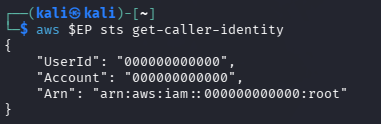

---

## Step 2 — Wait for LocalStack to Become Ready

### Command

    until curl -sf http://localhost:4566/_localstack/health >/dev/null; do sleep 2; done

### Result / Output

The command returned to the terminal after the LocalStack service became available.

### Explanation

The container can start before all services are ready. This command waits until the LocalStack endpoint is actually serving requests.

---

## Step 3 — Set the LocalStack Endpoint

### Command

    export EP='--endpoint-url=http://localhost:4566'

### Result / Output

The endpoint variable was configured for the AWS CLI.

### Explanation

The `EP` variable allows AWS CLI commands to communicate with the LocalStack endpoint instead of the real AWS environment.

---

## Step 4 — Verify AWS CLI Connectivity

### Command

    aws $EP sts get-caller-identity

### Result / Output

    {
        "UserId": "000000000000",
        "Account": "000000000000",
        "Arn": "arn:aws:iam::000000000000:root"
    }

### Explanation

The output confirms that the AWS CLI successfully communicated with LocalStack.

### Evidence

---

# TASK A1 — Reconstruct the Management Plane Audit Trail

Every administrative API call is a management plane event. Examples include creating or deleting resources, creating users, attaching policies, and other actions that reconfigure the cloud environment.

CloudTrail was not used because the required CloudTrail functionality is not included in the LocalStack licence used for this course. Therefore, the management plane trail was reconstructed from LocalStack's own request log.

---

## Step 5 — Create the Audit Trail Bucket

### Command

    aws $EP s3api create-bucket --bucket miit-audit-trail

    aws $EP s3api put-bucket-versioning --bucket miit-audit-trail \
      --versioning-configuration Status=Enabled

### Result / Output

The `miit-audit-trail` bucket was created and versioning was enabled.

### Explanation

The audit trail requires its own storage location. In a real deployment, the audit store should be located in a different account or separate trust boundary from the account being audited.

### Evidence

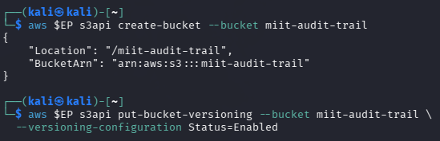

---

## Step 6 — Record the Baseline Log Position

### Command

    BEFORE=$(docker logs localstack 2>&1 | wc -l)
    echo "baseline: $BEFORE lines"

### Result / Output

    baseline: 349 lines

### Explanation

The baseline identifies the point at which the observation window begins. This allows the administrative activity generated afterwards to be extracted from the LocalStack request log.

### Evidence

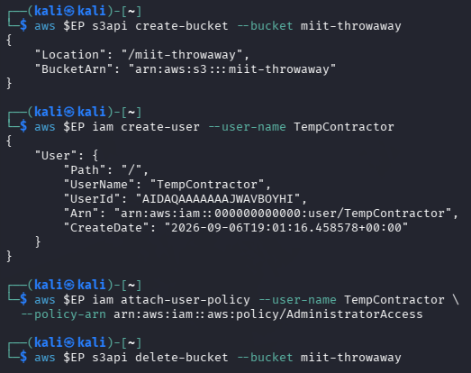

---

## Step 7 — Generate Administrative Management Plane Activity

### Command

    aws $EP s3api create-bucket --bucket miit-throwaway

    aws $EP iam create-user --user-name TempContractor

    aws $EP iam attach-user-policy --user-name TempContractor \
      --policy-arn arn:aws:iam::aws:policy/AdministratorAccess

    aws $EP s3api delete-bucket --bucket miit-throwaway

### Result / Output

The administrative actions were performed:

- `CreateBucket` — created `miit-throwaway`.
- `CreateUser` — created `TempContractor`.
- `AttachUserPolicy` — attached `AdministratorAccess` to `TempContractor`.
- `DeleteBucket` — deleted `miit-throwaway`.

### Explanation

These actions modify the cloud environment itself rather than the application workload. An attacker could use similar management plane actions to establish persistence, gain administrative privileges, or disrupt cloud resources.

### Evidence

---

## Step 8 — Extract the Management Plane Trail

### Command

    docker logs localstack 2>&1 | tail -n +$((BEFORE+1)) \
      | grep -E 'AWS [a-z0-9-]+\.[A-Za-z]+ => ' > mgmt-trail.log

    wc -l mgmt-trail.log

### Result / Output

The LocalStack request log was extracted into `mgmt-trail.log`.

### Explanation

LocalStack records AWS API calls in the form:

    AWS <service>.<Operation> => <status>

The extracted log therefore provides the raw management plane activity generated after the baseline.

### Evidence

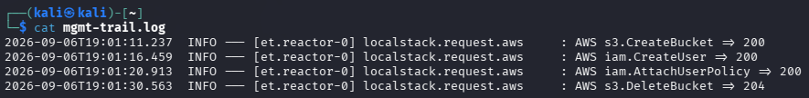

---

## Step 9 — Filter Security-Relevant Management Events

### Command

    grep -E '\.(CreateUser|AttachUserPolicy|DeleteUser|CreateBucket|DeleteBucket|PutBucketPolicy|ScheduleKeyDeletion) =>' mgmt-trail.log

### Result / Output

The management trail was filtered to identify security-relevant administrative operations.

### Explanation

The raw management trail can contain many events. Filtering focuses the investigation on actions that can change identities, permissions, or important cloud resources.

### Evidence

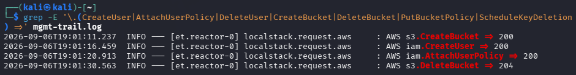

---

## Step 10 — Seal the Management Trail with SHA-256

### Command

    sha256sum mgmt-trail.log > mgmt-trail.sha256
    cat mgmt-trail.sha256

### Result / Output

A SHA-256 digest was generated for `mgmt-trail.log`.

### Explanation

The SHA-256 digest provides a cryptographic integrity check for the audit trail. If the contents of the log are changed, its calculated SHA-256 digest will also change.

The digest should be stored separately from the log so that an attacker cannot simply modify both the log and its digest.

### Evidence

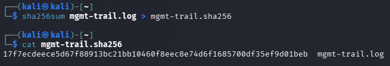

---

## Step 11 — Store the Trail and Digest in the Audit Store

### Command

    aws $EP s3 cp mgmt-trail.log s3://miit-audit-trail/
    aws $EP s3 cp mgmt-trail.sha256 s3://miit-audit-trail/

### Result / Output

Both the management trail and its SHA-256 digest were uploaded to `miit-audit-trail`.

### Explanation

The audit trail and its integrity digest are stored in a separate audit store. In a real cloud deployment, this store should be placed in a different account or trust boundary so that an attacker who compromises the audited account cannot easily modify the evidence.

### Evidence

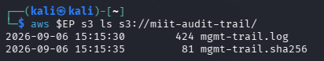

---

## Step 12 — Tamper with the Audit Trail and Verify the Digest

### Command

    grep -v 'AttachUserPolicy' mgmt-trail.log > t.log && mv t.log mgmt-trail.log

    aws $EP s3 cp s3://miit-audit-trail/mgmt-trail.sha256 ./check.sha256

    sha256sum -c check.sha256

### Result / Output

The verification failed:

    mgmt-trail.log: FAILED

### Explanation

The `AttachUserPolicy` event was removed from the local audit trail. This changed the contents of `mgmt-trail.log`, which caused its SHA-256 digest to differ from the trusted digest retrieved from the audit store.

The failed verification demonstrates that the alteration was detected.

### Evidence

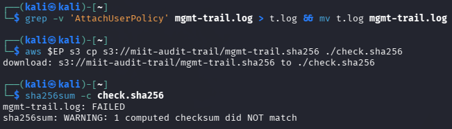

---

## Management Plane Investigation

The reconstructed trail proves that an API call occurred, but it does not provide all the information available in a real CloudTrail record.

Four important fields present in the real CloudTrail specimen but not reconstructed by this lab are:

1. `userIdentity`
   - Identifies the identity responsible for the API call.

2. `eventTime`
   - Establishes when the event occurred.

3. `sourceIPAddress`
   - Identifies the source address from which the request originated.

4. `requestParameters`
   - Shows important parameters supplied to the API operation.

Other fields in the real record include `userAgent`, `eventID`, `errorCode`, `readOnly`, and `managementEvent`.

The `sourceIPAddress` field is useful for correlation. If the same source address appears in another investigation, it can connect the two investigations into one potentially related incident.

The reconstructed trail was written by the same platform that served the API calls. An attacker with administrator privileges could potentially modify or delete the platform's logs. A real deployment reduces this risk by sending audit records to a separate trust boundary, such as a separate account, with restricted access and appropriate protection against modification.

None of the four administrative actions used in this task need to generate application traffic. This demonstrates why management plane telemetry must be collected separately from application logs.

---

# TASK A2 — Backup, and Why Versioning Is Not One

Task A2 creates a primary storage location and a genuinely separate backup destination.

---

## Step 13 — Create the Primary and DR Backup Buckets

### Command

    aws $EP s3api create-bucket --bucket miit-primary

    aws $EP s3api create-bucket --bucket miit-dr-backup

    aws $EP s3api put-bucket-versioning --bucket miit-primary \
      --versioning-configuration Status=Enabled

    aws $EP s3api put-bucket-versioning --bucket miit-dr-backup \
      --versioning-configuration Status=Enabled

### Result / Output

Two buckets were created:

- `miit-primary`
- `miit-dr-backup`

Versioning was enabled on both buckets.

### Explanation

The primary bucket is the main data store, while `miit-dr-backup` provides a separate recovery destination.

### Evidence

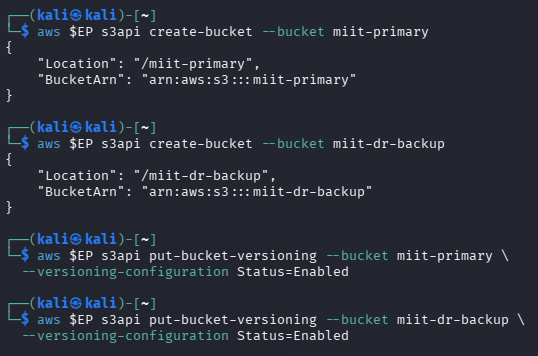

---

## Step 14 — Generate and Upload 200 Records to the Primary Bucket

### Command

    for i in $(seq 1 200); do
      echo "patient record $i - $(date)" > /tmp/rec$i.txt
    done

    aws $EP s3 sync /tmp/ s3://miit-primary/records/ --exclude '*' --include 'rec*.txt'

    aws $EP s3 ls s3://miit-primary/records/ | wc -l

### Result / Output

    200

### Explanation

Two hundred record files were generated and synchronised to the primary bucket. The object count confirms that all 200 records were present.

### Evidence

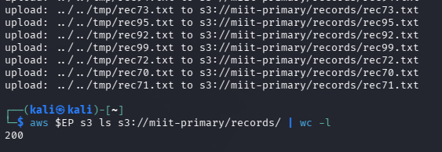

---

## Step 15 — Synchronise the Primary Bucket to the DR Backup

### Command

    aws $EP s3 sync s3://miit-primary s3://miit-dr-backup

    aws $EP s3 ls s3://miit-dr-backup/records/ | wc -l

### Result / Output

    200

### Explanation

The 200 records were successfully synchronised to the separate DR backup bucket.

Versioning is not the same as a backup. Versioning protects previous object states inside a bucket, while a separate backup provides a copy in another storage location and potentially another trust boundary.

### Evidence

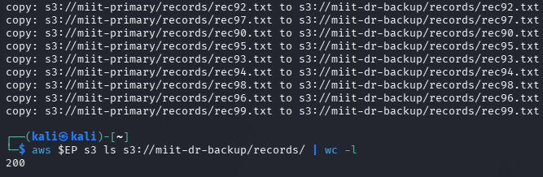

---

# TASK A3 — The Restore Drill (Timed)

Task A3 simulates a destructive incident and restores the data from the separate DR backup.

---

## Step 16 — Simulate the Destructive Incident

### Command

    aws $EP s3 rm s3://miit-primary/records/ --recursive

    aws $EP s3 ls s3://miit-primary/records/ | wc -l

### Result / Output

    0

### Explanation

The 200 current objects in the primary bucket were deleted to simulate a destructive incident.

Because versioning was enabled, previous object versions and delete markers remained in the bucket. However, the normal object listing returned zero current objects.

### Evidence

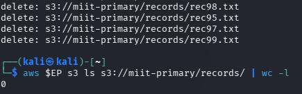

---

## Step 17 — Restore from the DR Backup and Measure RTO

### Command

    START=$(date +%s)

    aws $EP s3 sync s3://miit-dr-backup s3://miit-primary

    END=$(date +%s)

    echo "Objects restored: $(aws $EP s3 ls s3://miit-primary/records/ | wc -l)"

    echo "MEASURED RTO (seconds): $((END - START))"

### Result / Output

    Objects restored: 200
    MEASURED RTO (seconds): 2

### Explanation

All 200 records were successfully restored from the separate DR backup.

The measured RTO for this dataset was:

    2 seconds

This is the measured recovery time for 200 objects in the LocalStack laboratory environment.

### Evidence

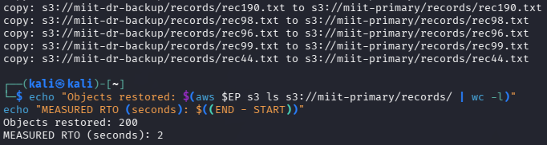

---

# TASK A4 — Compare the Two Recovery Paths

Task A4 compares recovery using in-place versioning with recovery from the separate backup bucket.

---

## Step 18 — Count Delete Markers

### Command

    aws $EP s3api list-object-versions --bucket miit-primary \
      --prefix records/ --query 'length(DeleteMarkers)'

### Result / Output

    200

### Explanation

There were 200 delete markers in the primary bucket. The delete operation created delete markers because versioning was enabled.

### Evidence

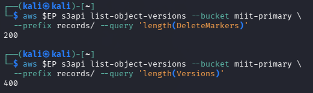

---

## Step 19 — Count Object Versions

### Command

    aws $EP s3api list-object-versions --bucket miit-primary \
      --prefix records/ --query 'length(Versions)'

### Result / Output

    400

### Explanation

There were 400 retained object versions in the primary bucket.

The result demonstrates that versioning retained object versions underneath the delete markers.

### Evidence

---

## Step 20 — Verify the Restored Primary Bucket

### Command

    aws $EP s3 ls s3://miit-primary/records/ | wc -l

### Result / Output

    200

### Explanation

The primary bucket contained 200 records after the restore, confirming that the data recovery was successful.

### Evidence

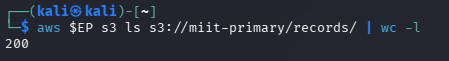

---

# RTO and RPO Results

| Measure | Result |
|---|---|
| Primary objects before incident | 200 |
| DR backup objects after sync | 200 |
| Primary objects immediately after deletion | 0 |
| Objects restored | 200 |
| Measured RTO | 2 seconds |
| Delete markers | 200 |
| Object versions | 400 |
| RPO | Time between the last pre-incident sync and the incident |

## Measured RTO

The measured RTO for 200 objects was:

    2 seconds

This is a laboratory measurement using LocalStack and should not be treated as a production RTO.

## Extrapolated RTO for 1,000,000 Objects

Using a simple linear scaling assumption:

    2 seconds × (1,000,000 / 200)
    = 10,000 seconds

Therefore:

    10,000 seconds
    ≈ 166.67 minutes
    ≈ 2.78 hours

The extrapolated RTO is therefore approximately:

    2.78 hours

The main assumption is that restore throughput scales linearly with the number of objects. This is an important limitation because real production throughput may not scale linearly due to network performance, object size, API limits, concurrency, storage performance, and other factors.

## RPO

RPO is the time between the most recent successful backup/synchronisation and the incident.

In this lab, the exact timestamps of the last pre-incident synchronisation and the destructive incident were not recorded. Therefore, an exact numerical RPO cannot be stated without inventing a value.

The correct interpretation is:

    RPO = time between the last pre-incident S3 sync and the incident

Data written during that interval would potentially be lost.

---

# Recovery Path Comparison

| Recovery Factor | Versioning (In-Place) | Separate Backup Bucket |
|---|---|---|
| Recovery speed | Usually faster for object-level recovery because previous versions remain in the same bucket | Requires restoring/copying data from another bucket |
| Survives bucket deletion? | No. The versions are inside the same bucket | Yes, if the separate backup remains unaffected |
| Survives a compromised admin credential? | Not necessarily. A compromised administrator may be able to affect the bucket and its versions | Potentially yes if the backup is protected by a separate trust boundary and separate access controls |
| Survives cryptographic erasure of the KMS key? | No if the retained versions depend on the erased key | Only if the backup uses an independently protected key that remains available |
| Cost profile | Additional storage cost for retained versions | Additional storage plus backup and restore operations |

---

# Short-Answer Questions

## Question 1

### Question

Name three administrative actions that would appear in a management plane trail but produce no application log at all. For each, state what an attacker gains by performing it.

### Answer

### 1. CreateUser

An attacker can create a new cloud identity that can be used for persistence or further activity.

### 2. AttachUserPolicy

An attacker can attach a privileged policy such as `AdministratorAccess`, gaining administrative control over cloud resources.

### 3. DeleteBucket

An attacker can delete cloud storage resources and disrupt or destroy access to stored data.

These actions occur at the management plane and do not necessarily generate application traffic because the workload does not receive these management API calls.

---

## Question 2

### Question

CloudTrail log file validation, the digest sealed in Task A1, and the hash chain built in Lab 5 Task 4 all solve the same problem by the same mechanism. Explain the mechanism, and state why the digest must be written to a different trust boundary from the account it audits.

### Answer

All three mechanisms use cryptographic hashing to detect changes to data.

A hash is calculated from the original log data. If the log is modified, its resulting hash changes. Comparing the new hash with the trusted original digest therefore allows modification to be detected.

The digest must be stored in a different trust boundary because an attacker who compromises the audited account may also be able to modify the log. If the digest is stored beside the log in the same compromised environment, the attacker could modify both the log and its digest.

Storing the digest in a separate trust boundary makes it more difficult for the attacker to alter both the evidence and its integrity record.

---

## Question 3

### Question

Distinguish RTO from RPO using your own measured figures. Which of the two is improved by taking backups more frequently, and which by restoring faster?

### Answer

RTO and RPO describe different recovery objectives.

**RTO (Recovery Time Objective)** is concerned with how quickly the system or data can be restored after an incident.

The measured RTO in this lab was:

    2 seconds for 200 objects

**RPO (Recovery Point Objective)** is concerned with how much data could potentially be lost between the last successful backup and the incident.

More frequent backups improve **RPO** because the time between backup points becomes shorter.

Faster restoration improves **RTO** because the recovery process completes more quickly.

Therefore:

- More frequent backups → improves RPO.
- Faster restoration → improves RTO.

---

## Question 4

### Question

Your measured RTO was a few seconds. Explain why you should not report that number to a board, and what you would report instead.

### Answer

The measured 2-second RTO was obtained using only 200 objects in a LocalStack laboratory environment. It does not represent the performance of a real production environment.

A production environment could contain a much larger dataset and could have different network throughput, storage performance, object sizes, API limits, and concurrency.

For this lab, a simple linear extrapolation to 1,000,000 objects gives:

    2 × (1,000,000 / 200)
    = 10,000 seconds
    ≈ 2.78 hours

I would report the validated production RTO from a realistic restore test. If production testing was not available, I would report the extrapolated estimate clearly as an estimate and state that it assumes linear scaling.

---

## Question 5

### Question

Using your A4 table, state one incident that versioning survives and the separate backup does not, and one that the backup survives and versioning does not.

### Answer

Versioning can survive an **individual object deletion or overwrite** because previous object versions remain available in the same bucket.

A separate backup can survive **deletion of the primary bucket** if the backup is stored separately and remains unaffected. Versioning does not provide this protection because the versions are stored inside the same bucket.

A separate backup can also provide stronger resilience against compromise of the primary account when the backup is placed in a separate trust boundary with separate access controls.

---

# Debrief Notes

The following points are important for the debrief discussion.

## Extrapolated RTO

The simple extrapolated RTO for 1,000,000 objects is approximately:

    2.78 hours

The assumption most sensitive to error is linear scaling of throughput. Real restore performance may not scale linearly with object count.

## Four-Hour RTO Promise

The simple extrapolation of approximately 2.78 hours is below four hours, but this does not prove that a four-hour production RTO is defensible.

A realistic production restore test would be required before making a reliable commitment to a four-hour RTO.

## Administrator Policy Alert

An `AttachUserPolicy` action that grants `AdministratorAccess` should generate a security alert because it represents a significant privilege change.

## Compromised Administrator Credential

If an attacker obtains administrator credentials, controls located inside the same trust boundary may also be exposed. A separately protected audit store and a separately protected backup destination provide stronger resilience because the attacker may not have equivalent access to those stores.

---

# Evidence Summary

The following evidence was collected:

1. `01_LocalStack_AWS_CLI_Connection.png`
2. `02_Audit_Trail_Bucket_Creation.png`
3. `03_Administrative_Management_Actions.png`
4. `04_Management_Plane_Audit_Trail.png`
5. `05_Filtered_Management_Plane_Events.png`
6. `06_Audit_Trail_SHA256_Digest.png`
7. `07_Audit_Trail_Stored_in_Separate_Bucket.png`
8. `08_Audit_Trail_Tampering_Detected.png`
9. `09_Primary_and_DR_Backup_Buckets.png`
10. `10_Primary_Bucket_200_Objects.png`
11. `11_DR_Backup_200_Objects.png`
12. `12_Primary_Bucket_Destructive_Incident.png`
13. `13_Timed_Restore_Measured_RTO.png`
14. `14_Versioning_Delete_Markers_and_Versions.png`
15. `15_Primary_Bucket_Post_Restore_Verification.png`

---

# Conclusion

This lab demonstrated the importance of management plane auditing and tested disaster recovery using a separate backup destination.

The management plane audit trail was reconstructed from LocalStack request logs because CloudTrail was not available in the LocalStack licence used for the course. Security-relevant administrative actions were filtered, the resulting trail was sealed with a SHA-256 digest, and the trail was stored together with its digest in a separate audit bucket. After the `AttachUserPolicy` event was removed, SHA-256 verification failed, demonstrating that the tampering was detected.

For disaster recovery, 200 objects were stored in the primary bucket and synchronised to a separate DR backup bucket. After the primary records were deleted, all 200 objects were restored successfully from the DR backup. The measured RTO was 2 seconds for the 200-object laboratory dataset.

The primary bucket contained 200 delete markers and 400 retained versions after the destructive deletion. This demonstrated that versioning can help recover individual object changes, but versioning is not equivalent to a separate backup. A separate backup provides stronger protection against incidents such as primary bucket deletion or compromise when it is maintained in a separate trust boundary.

The measured RTO should not be treated as a production guarantee. A simple linear extrapolation gives approximately 2.78 hours for 1,000,000 objects, but realistic production testing is required to establish a defensible RTO. RPO depends on the interval between the most recent backup and the incident, while faster restoration improves RTO.

---

# Cleanup

The following commands remove the lab resources after the assessment:

    aws $EP s3 rb s3://miit-dr-backup --force

    aws $EP s3 rb s3://miit-audit-trail --force

    aws $EP iam detach-user-policy --user-name TempContractor \
      --policy-arn arn:aws:iam::aws:policy/AdministratorAccess

    aws $EP iam delete-user --user-name TempContractor

    docker rm -f localstack

    rm -f /tmp/rec*.txt mgmt-trail.log mgmt-trail.sha256 check.sha256

---

# References

1. IKB42603 Cloud Computing Security Essentials — Lab 5 Addendum: Management Plane Audit, Backup & the Restore Drill.
2. Course lectures — Week 2: Security Design & Architecture.
3. Course lectures — Week 6: Monitoring, Auditing & Management.
4. AWS CloudTrail log file integrity validation documentation.
5. CSA Security Guidance v5 — Domain 6: Security Monitoring.
6. CSA Security Guidance v5 — Domain 11: Incident Response & Resilience.
7. IKB42603 Lab 5 — Monitoring, Logging & Incident Detection.
8. IKB42603 Lab 6 — Object Storage Security, including versioning and delete markers.
