# IKB42603 Cloud Computing Security Essentials
## Lab 6 — Object Storage Security & Data Security Lifecycle
  
**Course:** IKB42603 Cloud Computing Security Essentials  
**Lab:** Lab 6  
**Platform:** Amazon S3 on LocalStack

---

# 1. Task 1 — Object Storage and Data Classification

A bucket was created using the naming pattern:

`miit-patient-records-$RANDOM`

Three objects were created and classified according to their sensitivity.

| Object | Classification | Example Data | Security Control Implemented |
|---|---|---|---|
| `public/notice.txt` | Public | Ward visiting hours | Classification tag and Block Public Access |
| `internal/roster.txt` | Internal | Staff duty schedule | Classification tag and least-privilege access |
| `confidential/record.txt` | Confidential | Patient diagnosis / health record | Classification tag, SSE-KMS, Block Public Access, versioning and lifecycle |

The confidential object was verified with the classification tag:

`classification=confidential`

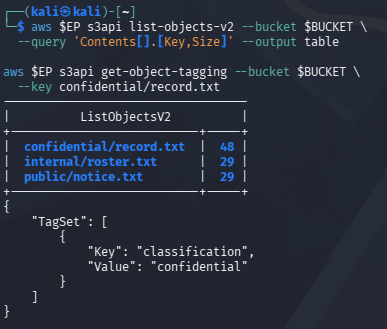

---

# 2. Task 2 — Public Bucket Exposure

A deliberately insecure bucket policy was created with:

`"Principal": "*"`

and:

`s3:GetObject`

The anonymous request to the confidential object returned HTTP 200 and exposed the record.

The exposure was caused by the wildcard principal because it allows access from any principal when the policy permits the requested action.

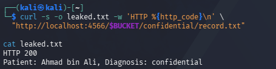

---

# 3. Task 3 — Block Public Access and Least Privilege

The insecure public bucket policy was removed.

All four Block Public Access settings were enabled:

- BlockPublicAcls
- IgnorePublicAcls
- BlockPublicPolicy
- RestrictPublicBuckets

The anonymous read was retested and a least-privilege bucket policy was configured.

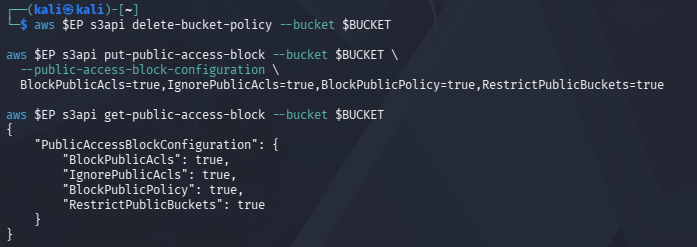

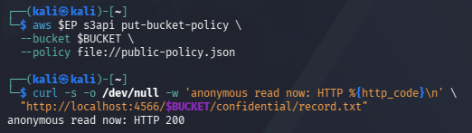

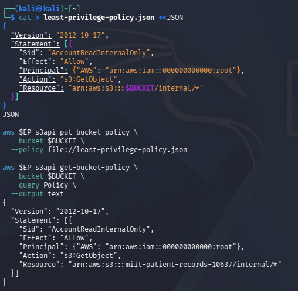

---

# 4. Task 4 — IAM and Resource-Based Policy Evaluation

An IAM user named `DataAnalyst` was created.

An identity-based IAM policy provided S3 read/list permissions.

A bucket resource-based policy was configured to allow access to the internal prefix and explicitly deny access to the confidential prefix.

The intended evaluation was:

- `internal/roster.txt` → Allowed
- `confidential/record.txt` → Denied

However, the LocalStack environment did not enforce the expected explicit Deny for the confidential request. The confidential request still succeeded.

The policy configuration was retained as evidence of the intended authorization logic and the LocalStack enforcement limitation was documented.

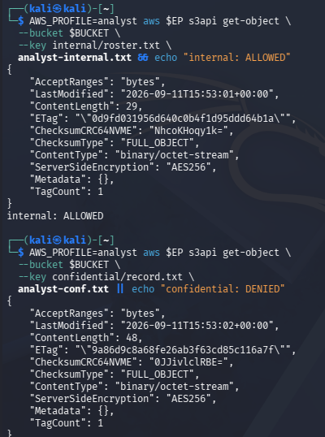

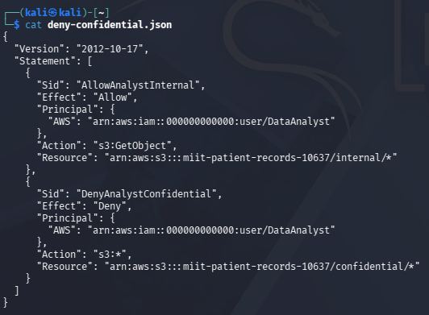

---

# 5. Task 5 — SSE-KMS Encryption

A KMS customer key was created and configured as the bucket's default encryption key.

The KMS key used was:

`86c4d09c-0a4a-47c2-b843-de34dd315bab`

The bucket was configured with:

`SSEAlgorithm = aws:kms`

and Bucket Key enabled.

The `head-object` output verified the KMS encryption configuration.

SSE-KMS protects data at rest through encryption, but it does not replace authorization. Access control is still determined by IAM and resource-based policies.

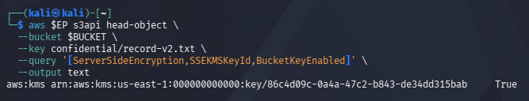

---

# 6. Task 6 — Secure Transport

A bucket policy using the condition:

`aws:SecureTransport = false`

was configured with an explicit Deny to prevent unencrypted transport.

The bucket-wide access test was performed.

In the LocalStack environment, the expected AWS denial was not reproduced. This was documented as a LocalStack policy-enforcement limitation.

The SecureTransport policy was removed after the test.

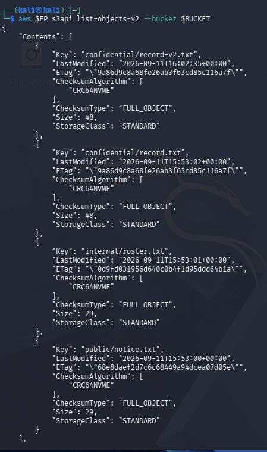

---

# 7. Task 7 — Versioning, Delete Marker and Data Remanence

S3 versioning was enabled.

Multiple versions of:

`confidential/record.txt`

were uploaded.

The version listing demonstrated that previous versions remain available even when a newer version exists.

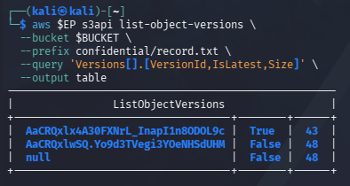

A normal `delete-object` operation created a Delete Marker because versioning was enabled.

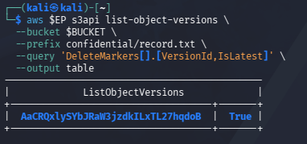

The original version was then recovered using its version ID.

The recovered record contained:

`Patient: Ahmad bin Ali, Diagnosis: hypertension`

This demonstrated that a normal delete operation does not necessarily remove previous versions.

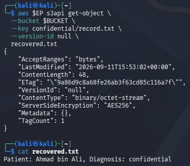

---

# 8. Task 8 — Lifecycle and Cryptographic Erasure

A lifecycle configuration was created for confidential records.

The `RetireConfidentialRecords` rule specifies:

- Prefix: `confidential/`
- Expiration: 365 days
- Noncurrent version expiration: 30 days

The `AbortIncompleteUploads` rule specifies:

- Abort incomplete multipart uploads after 7 days.

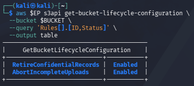

The KMS key was disabled and scheduled for deletion with a seven-day pending deletion period.

The resulting key state was verified as `PendingDeletion`.

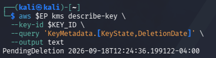

LocalStack may still allow an encrypted object to be read after the key has been disabled because the emulator does not always re-check KMS key state during object reads.

Cryptographic erasure provides stronger deletion assurance because destroying the encryption key can make encrypted data unusable, even when storage copies remain.

---

# 9. Data Classification Table

| Object | Classification | Example Data | Control Implemented |
|---|---|---|---|
| `public/notice.txt` | Public | Ward visiting hours | Classification tag + Block Public Access |
| `internal/roster.txt` | Internal | Staff duty schedule | Classification tag + least-privilege access |
| `confidential/record.txt` | Confidential | Patient diagnosis | Classification tag + SSE-KMS + Block Public Access + versioning + lifecycle |

---

# 10. Short-Answer Questions

## 1. Which single element caused the exposure, and why is Principal "*" more dangerous on a bucket policy than an over-broad IAM policy attached to one user?

The exposure was caused by `"Principal": "*"`. This wildcard represents any principal and can permit anonymous or public access when combined with a permitted action such as `s3:GetObject`.

A bucket policy is resource-based and applies directly to the bucket. Therefore, a wildcard principal can expose the resource to a broad population. An over-broad IAM policy attached to one user mainly expands the permissions of that particular identity.

## 2. Explain the difference between an identity-based policy and a resource-based policy. In Task 4, which one decided each of the analyst's two requests?

An identity-based policy is attached to an IAM identity such as a user, group or role and defines what that identity is allowed to perform.

A resource-based policy is attached directly to a resource such as an S3 bucket and defines which principals can access that resource.

In Task 4, the intended evaluation was that the internal request was allowed and the confidential request was explicitly denied by the resource-based bucket policy. However, LocalStack did not enforce the expected explicit Deny for the confidential request, so the actual emulator result was documented as a limitation.

## 3. Block Public Access is described as a guardrail rather than a control. What is the difference, and why does the distinction matter for an organisation with many engineers?

A control directly implements a specific security requirement, such as an IAM or bucket policy.

A guardrail provides a broader safety boundary that prevents or reduces dangerous configurations.

Block Public Access is important for organisations with many engineers because it reduces the risk that one engineer accidentally creates a publicly accessible storage resource. It does not replace detailed access-control policies.

## 4. Your bucket has default SSE-KMS encryption. Does that protect the confidential record from the analyst?

No, not by itself.

SSE-KMS protects data at rest by encrypting the object using a KMS key. It does not determine whether an analyst is authorised to access the object.

Authorization is handled separately through IAM and resource-based policies.

Therefore, encryption protects stored data while authorization determines who can access it.

## 5. A patient invokes their right to erasure. Using your Task 7 evidence, explain why delete-object alone is not compliant, and describe two mechanisms that would make the deletion provable.

With versioning enabled, `delete-object` creates a Delete Marker instead of automatically removing previous versions.

Task 7 demonstrated that the original version could still be recovered after the Delete Marker was created.

Two mechanisms that provide stronger deletion assurance are:

1. Permanently delete all object versions and Delete Markers.
2. Use cryptographic erasure by destroying the KMS key protecting the encrypted data.

## 6. You are the auditor in Week 11. Name three commands from this lab whose output you would collect as compliance evidence, and state which control each one evidences.

| Command | Control Evidenced |
|---|---|
| `aws $EP s3api get-public-access-block --bucket $BUCKET` | Block Public Access configuration |
| `aws $EP s3api get-bucket-encryption --bucket $BUCKET` | Default SSE-KMS encryption |
| `aws $EP s3api get-bucket-lifecycle-configuration --bucket $BUCKET` | Lifecycle and retention configuration |

---

# 11. Final Verification

The final security posture was verified using the required commands.

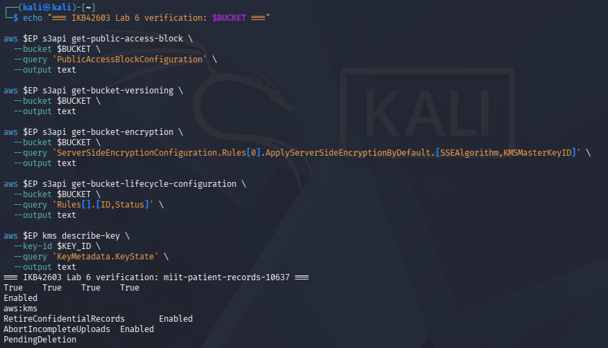


## 12. Final Verification Command Output

```text
=== IKB42603 Lab 6 verification: miit-patient-records-10637 ===
True	True	True	True
Enabled
aws:kms	
RetireConfidentialRecords	Enabled
AbortIncompleteUploads	Enabled
PendingDeletion
```
